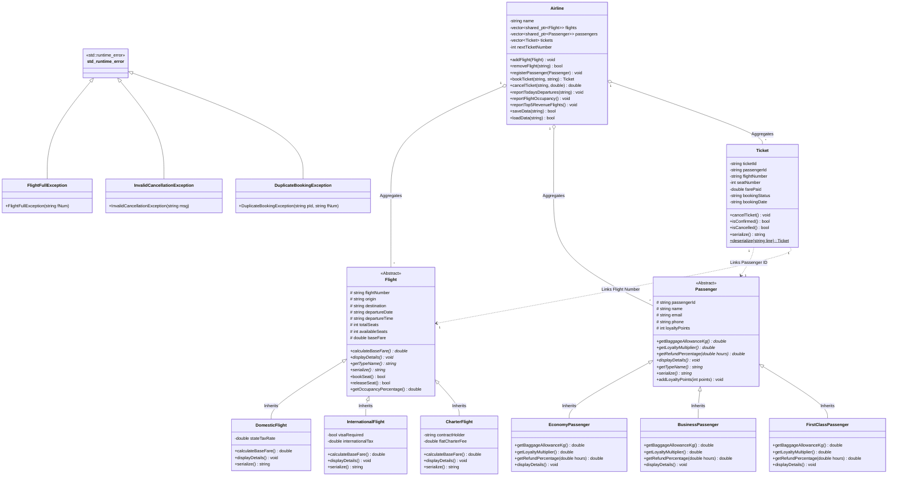

# SkyLink Airways - UML Class Diagram Documentation

This document contains the complete UML Class Diagram for the **SkyLink Airways Airline Reservation & Flight Management System**, illustrating class attributes, methods, inheritance hierarchies, and aggregation relationships.

---

## Mermaid Class Diagram

---

## Detailed Relationship Explanations

1. **Inheritance ($\rightarrow$)**:
   - `DomesticFlight`, `InternationalFlight`, and `CharterFlight` extend abstract base class `Flight`.
   - `EconomyPassenger`, `BusinessPassenger`, and `FirstClassPassenger` extend `Passenger`.
2. **Aggregation ($o-$)**:
   - `Airline` aggregates dynamic vectors of `Flight` pointers (`std::shared_ptr<Flight>`), `Passenger` pointers (`std::shared_ptr<Passenger>`), and `Ticket` objects.
3. **Association / Dependency ($\cdot\cdot>$)**:
   - `Ticket` references `passengerId` and `flightNumber` to connect a registered passenger to a scheduled flight.
