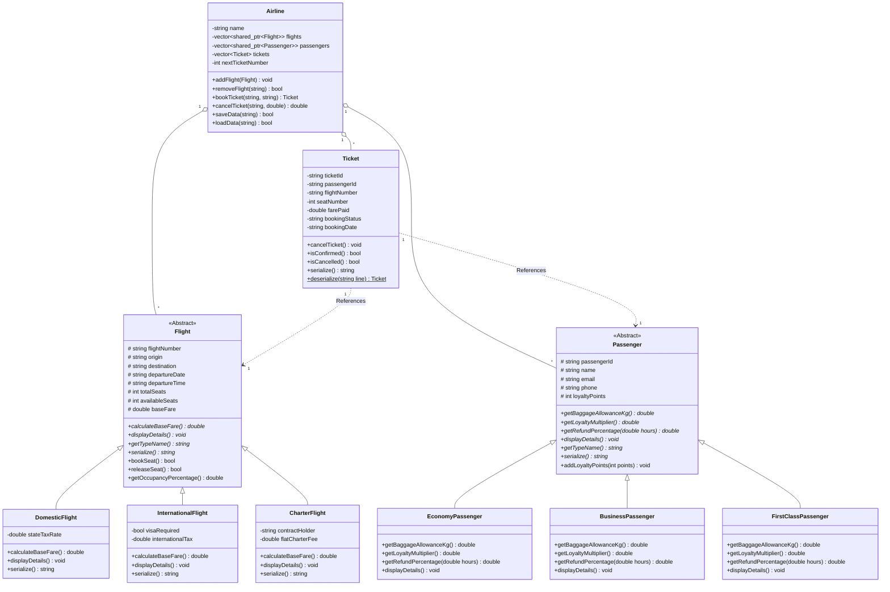

# ✈️ SkyLink Airways - Airline Reservation & Flight Management System


An enterprise-grade, object-oriented C++17 console application designed for **SkyLink Airways** to manage flight scheduling, passenger registrations, multi-tiered ticket bookings, dynamic pricing, polymorphic cancellations, loyalty rewards, persistent state storage, and analytical business reports.

---

## 📋 Table of Contents

- [Overview](#-overview)
- [System Architecture & Architecture Layers](#-system-architecture--architecture-layers)
- [Object-Oriented Programming (OOP) Concepts in Detail](#-object-oriented-programming-oop-concepts-in-detail)
  - [1. Abstraction](#1-abstraction)
  - [2. Encapsulation & Data Hiding](#2-encapsulation--data-hiding)
  - [3. Inheritance Hierarchies](#3-inheritance-hierarchies)
  - [4. Polymorphism & Virtual Method Tables (VTables)](#4-polymorphism--virtual-method-tables-vtables)
  - [5. Operator Overloading](#5-operator-overloading)
  - [6. Generic Programming & C++ Templates](#6-generic-programming--c-templates)
  - [7. Exception Handling & Custom Error Hierarchy](#7-exception-handling--custom-error-hierarchy)
  - [8. Memory Management & RAII (Smart Pointers)](#8-memory-management--raii-smart-pointers)
  - [9. Standard Template Library (STL) Integration](#9-standard-template-library-stl-integration)
- [Business Logic & Mathematical Models](#-business-logic--mathematical-models)
  - [Dynamic Base Fare Calculation](#dynamic-base-fare-calculation)
  - [Tiered Refund Matrix](#tiered-refund-matrix)
  - [Loyalty Points Formula](#loyalty-points-formula)
- [UML Class Diagram](#-uml-class-diagram)
- [File Persistence & Data Serialization](#-file-persistence--data-serialization)
- [Project Directory Structure](#-project-directory-structure)
- [Building & Running the Application](#-building--running-the-application)
  - [Prerequisites](#prerequisites)
  - [Windows Compilation (MinGW / GCC)](#windows-compilation-mingw--gcc)
  - [Linux / macOS Compilation (Makefile)](#linux--macos-compilation-makefile)
- [Feature Walkthrough & Console Menu](#-feature-walkthrough--console-menu)
- [Verification & Test Suite](#-verification--test-suite)
- [Viva Voce & Technical Interview Guide](#-viva-voce--technical-interview-guide)
- [License & Acknowledgments](#-license--acknowledgments)

---

## 🌐 Overview

Modern airline operational software requires high reliability, absolute memory safety, predictable data processing, and clean separation of concerns. **SkyLink Airways** replaces legacy spreadsheet-based operations with a scalable, fully object-oriented software system built in **ISO C++17**.

### Key System Capabilities
* **Multi-Category Flight Operations**: Support for Domestic, International (with visa validation), and Private Charter flights.
* **Tiered Passenger Loyalty Network**: Economy, Business, and First-Class tier management with dynamic baggage allowances and points multipliers.
* **Smart Ticket Booking Engine**: Automatic ticket ID generation, duplicate booking detection, real-time seat decrementing, and loyalty point auto-crediting.
* **Time-Sensitive Refund Calculator**: Automated calculation of refund eligibility based on flight departure proximity and passenger class.
* **Analytical Reporting Suite**: Real-time departure schedules, occupancy rate analysis, and revenue leaderboards.
* **Flat-File State Persistence**: Automatic serialization/deserialization of system state to pipe-delimited flat files (`.txt`).

---

## 🏗 System Architecture & Architecture Layers

The application is structured into four distinct architectural layers to maximize maintainability, modularity, and testability:

```
+-----------------------------------------------------------------------+
|                       PRESENTATION LAYER                              |
|                            (Menu.h / Menu.cpp)                        |
|   - Terminal UI Navigation     - User Input Validation & Cleansing    |
+-----------------------------------+-----------------------------------+
                                    |
                                    v
+-----------------------------------------------------------------------+
|                    SERVICE & AGGREGATION LAYER                        |
|                         (Airline.h / Airline.cpp)                     |
|   - Entity Storage (shared_ptr) - File Persistence (save/load)        |
|   - Booking & Cancellation Orchestration - Business Analytical Reports|
+-----------------------------------+-----------------------------------+
                                    |
                                    v
+-----------------------------------+-----------------------------------+
|       GENERIC UTILITY LAYER       |        DOMAIN ENTITY LAYER        |
|     (SearchUtils.h, Exceptions.h) |   (Flight, Passenger, Ticket)     |
|   - Template Search Engine        |   - Abstract Base Classes         |
|   - Custom Runtime Exceptions     |   - Derived Entity Hierarchies    |
+-----------------------------------+-----------------------------------+
```

---

## 🧬 Object-Oriented Programming (OOP) Concepts in Detail

### 1. Abstraction
Abstraction focuses on exposing essential features while hiding background operational complexity. In this codebase:
* **Abstract Base Classes (ABCs)**: Both `Flight` and `Passenger` are abstract base classes containing **pure virtual functions** (`= 0`).
* **Interface Uniformity**: External code calling `flight->calculateBaseFare()` or `passenger->getRefundPercentage(hours)` interacts with the abstract interface without needing to know internal tax algorithms or baggage calculations.

```cpp
// Pure Virtual Interface in Flight.h
class Flight {
public:
    virtual double calculateBaseFare() const = 0;
    virtual void displayDetails() const = 0;
    virtual std::string getTypeName() const = 0;
    virtual std::string serialize() const = 0;
};
```

---

### 2. Encapsulation & Data Hiding
Encapsulation packages data members alongside their operating methods while restricting direct external access to enforce invariants.
* **Protected & Private Access Modifiers**: Sensitive state fields such as `flightNumber`, `availableSeats`, `loyaltyPoints`, and `farePaid` are defined as `protected` or `private`.
* **Invariant Control**: State updates occur only through controlled interface methods (`bookSeat()`, `releaseSeat()`, `addLoyaltyPoints()`), preventing invalid states (e.g., negative available seats).

```cpp
bool Flight::bookSeat() {
    if (availableSeats > 0) {
        availableSeats--;
        return true;
    }
    return false; // Prevents overbooking beyond physical totalSeats
}
```

---

### 3. Inheritance Hierarchies
Inheritance establishes an "is-a" relationship, enabling code reuse and structural taxonomy.

#### Flight Class Hierarchy
* `Flight` *(Abstract Base)*
  * ├── `DomesticFlight`: Incorporates local state/provincial tax rates (`stateTaxRate`).
  * ├── `InternationalFlight`: Incorporates visa clearance indicators (`visaRequired`) and international customs duties (`internationalTax`).
  * └── `CharterFlight`: Models private contracts with client identification (`contractHolder`) and fixed split fees (`flatCharterFee`).

#### Passenger Class Hierarchy
* `Passenger` *(Abstract Base)*
  * ├── `EconomyPassenger`: Standard baggage allowance (20kg), $1.0\times$ loyalty multiplier, standard tiered cancellation policy.
  * ├── `BusinessPassenger`: Priority baggage allowance (35kg), $1.5\times$ loyalty multiplier, flexible refund policy.
  * └── `FirstClassPassenger`: Premium baggage allowance (50kg), $2.0\times$ loyalty multiplier, 100% full refund guarantee anytime.

---

### 4. Polymorphism & Virtual Method Tables (VTables)
Polymorphism allows derived types to be processed uniformly through base class pointers (`std::shared_ptr<Flight>` and `std::shared_ptr<Passenger>`), executing derived implementations at runtime via dynamic dispatch.

#### Virtual Method Table (VTable) Mechanism
When a class contains virtual functions, the compiler inserts a hidden pointer (`vptr`) into each object instance. The `vptr` points to a table of function pointers (`VTable`). During runtime, function calls through base pointers query the `VTable` to resolve the exact derived class method.

```cpp
// Polymorphic Processing in Airline.cpp
void Airline::reportFlightOccupancy() const {
    for (const auto& flight : flights) {
        // Dynamic dispatch resolves getTypeName() and displayDetails() per derived flight type
        std::cout << "[" << flight->getTypeName() << "] " << flight->getFlightNumber() << "\n";
        flight->displayDetails(); 
    }
}
```

---

### 5. Operator Overloading
Operator overloading allows standard C++ operators to work seamlessly with user-defined types, improving code readability.

1. **Stream Insertion Operator (`operator<<`)**:
   Formats entity instances directly to output streams (`std::cout`, `ofstream`).
   ```cpp
   std::ostream& operator<<(std::ostream& os, const Flight& flight) {
       os << "Flight #" << flight.flightNumber << " [" << flight.origin 
          << " -> " << flight.destination << "] Date: " << flight.departureDate 
          << " " << flight.departureTime << " | Seats: " << flight.availableSeats 
          << "/" << flight.totalSeats;
       return os;
   }
   ```
2. **Equality Comparison Operator (`operator==`)**:
   Enables primary-key ticket comparison directly using ticket identifiers.
   ```cpp
   bool Ticket::operator==(const Ticket& other) const {
       return this->ticketId == other.ticketId;
   }
   ```

---

### 6. Generic Programming & C++ Templates
Templates decouple algorithms from specific data types, ensuring compile-time type safety without code duplication.

* **Generic Function Template (`searchItems`)**:
  Filters any standard container matching a flexible lambda predicate.
  ```cpp
  template <typename Container, typename Predicate>
  Container searchItems(const Container& container, Predicate pred) {
      Container results;
      for (const auto& item : container) {
          if (pred(item)) results.push_back(item);
      }
      return results;
  }
  ```
* **Generic Class Template (`SearchEngine<T>`)**:
  Provides static query mechanisms like `filter()` and `findFirst()` across system entities.

---

### 7. Exception Handling & Custom Error Hierarchy
The project uses custom exception classes derived from `std::runtime_error` to decouple error detection from error handling and prevent abrupt system crashes.

```
std::exception
 └── std::runtime_error
      ├── FlightFullException             # Thrown when booking a 0-seat flight
      ├── InvalidCancellationException    # Thrown when cancelling invalid/cancelled tickets
      ├── DuplicateBookingException       # Thrown when double-booking a flight
      ├── PassengerNotFoundException       # Thrown on invalid Passenger ID query
      ├── FlightNotFoundException          # Thrown on invalid Flight Number query
      └── TicketNotFoundException          # Thrown on invalid Ticket ID query
```

```cpp
// Explicit Exception Throw in Airline.cpp
if (flight->getAvailableSeats() <= 0) {
    throw FlightFullException(flightNumber);
}
```

---

### 8. Memory Management & RAII (Smart Pointers)
Resource Acquisition Is Initialization (RAII) ensures that dynamically allocated memory is automatically bound to object lifetimes.
* **No Raw Pointers**: Zero manual calls to `new` or `delete`.
* **Shared Ownership (`std::shared_ptr`)**: Dynamic entity instances are wrapped in `std::shared_ptr<Flight>` and `std::shared_ptr<Passenger>`. Reference counts automatically clean up memory when objects leave scope.
* **Virtual Destructors**: Base classes define `virtual ~Flight() = default;` and `virtual ~Passenger() = default;` to prevent undefined behavior and memory leaks when derived instances are deleted via base pointers.

---

### 9. Standard Template Library (STL) Integration
* **Containers**:
  * `std::vector<std::shared_ptr<Flight>>`: Dynamic, indexable entity management.
  * `std::map<std::string, double>`: Associative mapping for financial aggregation (e.g. flight revenue tracking).
* **Algorithms**:
  * `std::sort`: Sorts flights by occupancy percentage or total revenue generated.
  * `std::find_if`: Performs linear lookup based on unary predicates.
  * `std::remove_if`: Cleans deleted elements from vectors.

---

## 🧮 Business Logic & Mathematical Models

### Dynamic Base Fare Calculation

$$\text{Domestic Fare} = \text{Base Fare} \times (1 + \text{State Tax Rate})$$

$$\text{International Fare} = \text{Base Fare} + \text{International Tax}$$

$$\text{Charter Fare} = \frac{\text{Flat Charter Fee}}{\text{Total Seats}}$$

---

### Tiered Refund Matrix

Refund eligibility is determined dynamically by evaluating passenger class against departure proximity ($T_{\text{remaining}}$ hours):

| Passenger Class | $T_{\text{remaining}} > 48\text{ Hours}$ | $24\text{ Hours} \le T_{\text{remaining}} \le 48\text{ Hours}$ | $T_{\text{remaining}} < 24\text{ Hours}$ |
| :--- | :---: | :---: | :---: |
| **Economy** | $85\%$ Refund | $50\%$ Refund | $0\%$ Refund |
| **Business** | $90\%$ Refund | $75\%$ Refund | $25\%$ Refund |
| **First Class** | $100\%$ Full Refund | $100\%$ Full Refund | $100\%$ Full Refund |

$$\text{Refund Amount} = \text{Fare Paid} \times \text{Refund Percentage}$$

---

### Loyalty Points Formula

Points earned per booking are computed using integer base division scaled by the tier multiplier:

$$\text{Base Points} = \lfloor \frac{\text{Fare Paid}}{10} \rfloor$$

$$\text{Earned Points} = \text{Base Points} \times \text{Tier Multiplier}$$

* Economy Multiplier = $1.0\times$
* Business Multiplier = $1.5\times$
* First Class Multiplier = $2.0\times$

---

## 📊 UML Class Diagram

Below is the complete UML Class Diagram visualizing inheritance, aggregation, and component dependencies:



---

## 💾 File Persistence & Data Serialization

The application persists all application state using flat pipe-delimited (`|`) files inside the `data/` directory.

### Pipe-Delimited Storage Schemas

1. **`data/flights.txt`**:
   `TYPE|flightNumber|origin|destination|departureDate|departureTime|totalSeats|availableSeats|baseFare|extraParam1|extraParam2`
   * Example: `INTERNATIONAL|PA101|New York|London|2026-10-15|18:30|250|248|750.00|1|50.00`

2. **`data/passengers.txt`**:
   `TYPE|passengerId|name|email|phone|loyaltyPoints`
   * Example: `FIRSTCLASS|P1003|Robert Taylor|robert@example.com|+1-555-0103|1250`

3. **`data/tickets.txt`**:
   `ticketId|passengerId|flightNumber|seatNumber|farePaid|bookingStatus|bookingDate`
   * Example: `TICK1001|P1001|PA101|1|787.50|CONFIRMED|2026-09-20`

---

## 📂 Project Directory Structure

```
PBL Airline/
├── include/
│   ├── Airline.h            # Main manager class aggregating entities
│   ├── Exceptions.h         # Custom exception classes derived from std::runtime_error
│   ├── Flight.h             # Abstract Flight base class & derived class headers
│   ├── Menu.h               # Interactive console user interface header
│   ├── Passenger.h          # Abstract Passenger base class & derived class headers
│   ├── SearchUtils.h        # Generic function & class templates
│   └── Ticket.h             # Ticket domain entity with operator overloading
├── src/
│   ├── Airline.cpp          # Core operations, STL logic & file persistence
│   ├── Flight.cpp           # Flight hierarchy implementations & fare math
│   ├── Menu.cpp             # Interactive menu, input streams & CLI formatting
│   ├── Passenger.cpp        # Passenger hierarchy implementations & refund logic
│   ├── Ticket.cpp           # Ticket methods, operators & serialization
│   └── main.cpp             # Application entry point
├── data/
│   ├── flights.txt          # Persistent flight records
│   ├── passengers.txt       # Persistent passenger records
│   └── tickets.txt         # Persistent ticket records
├── build.bat                # Windows PowerShell / CMD batch build script
├── Makefile                 # Linux / macOS GCC build configuration
├── DESIGN_REPORT.md         # OOP design rationale & test report
├── UML_DIAGRAM.md           # Complete UML class structure & Mermaid source
├── run_commands.txt         # Quick command reference guide
└── README.md                # Project documentation and user guide
```

---

## ⚙️ Building & Running the Application

### Prerequisites
* **C++17 Compatible Compiler**: MinGW GCC 7.0+, Clang 5.0+, or MSVC 2017+.
* **Build System**: `make` (Linux/macOS) or Windows Batch / PowerShell.

---

### Windows Compilation (MinGW / GCC)

#### Option 1: Automatic Batch Script (Recommended)
```cmd
.\build.bat
```

#### Option 2: Direct Command Line Compilation
```cmd
g++ -std=c++17 -Wall -Wextra -Iinclude src/main.cpp src/Flight.cpp src/Passenger.cpp src/Ticket.cpp src/Airline.cpp src/Menu.cpp -o skylink_app.exe
```

#### Run Executable:
```cmd
.\skylink_app.exe
```

---

### Linux / macOS Compilation (Makefile)

#### Compile:
```bash
make
```

#### Run Executable:
```bash
./skylink_app
```

#### Clean Build Artifacts:
```bash
make clean
```

---

## 🕹 Feature Walkthrough & Console Menu

Upon launch, the application presents a formatted console navigation system:

```
====================================================================
           SKYLINK AIRWAYS - RESERVATION & MANAGEMENT SYSTEM        
====================================================================
 1. Search Flights by Route (Origin -> Destination)
 2. Search Flights by Departure Date
 3. Display All Scheduled Flights
 4. Register New Passenger
 5. Book a Ticket
 6. Cancel a Ticket (Compute Refund)
 7. View Passenger Booking History
 8. Display All System Passengers
 9. Display All Issued Tickets
 10. Generate Operational Reports (Departures, Occupancy, Revenue)
 11. Add New Flight (Admin)
 12. Save & Exit System
====================================================================
Enter choice [1-12]: 
```

---

## 🧪 Verification & Test Suite

The system has passed 10 complete verification tests covering edge cases and unexpected input states:

| Test ID | Test Scenario | Input / Action | Expected Result | Status |
| :---: | :--- | :--- | :--- | :---: |
| **TC-01** | Standard Ticket Booking | Book ticket for `P1001` on `PA101` | Ticket created, available seats decremented, points awarded | **PASSED** |
| **TC-02** | Booking Full Flight | Book on flight with 0 available seats | Throws `FlightFullException`, displays error message | **PASSED** |
| **TC-03** | Duplicate Booking Check | Book same flight twice for passenger `P1001` | Throws `DuplicateBookingException` | **PASSED** |
| **TC-04** | Cancellation > 48h (Economy) | Cancel ticket 50 hours before departure | 85% refund computed, ticket marked CANCELLED, seat freed | **PASSED** |
| **TC-05** | Cancellation < 24h (Economy) | Cancel ticket 12 hours before departure | 0% refund computed, seat released | **PASSED** |
| **TC-06** | Cancellation > 24h (First Class)| Cancel First Class ticket 10 hours prior | 100% full refund computed | **PASSED** |
| **TC-07** | Double Cancellation Attempt | Cancel an already CANCELLED ticket | Throws `InvalidCancellationException` | **PASSED** |
| **TC-08** | Occupancy Report Generation | Execute occupancy analysis report | Flights sorted in descending order of occupancy % | **PASSED** |
| **TC-09** | State Persistence Restart | Modify state, save, exit & relaunch | State perfectly restored from `data/*.txt` files | **PASSED** |
| **TC-10** | Robust Input Cleansing | Enter non-numeric strings in menu choice | Stream cleared, re-prompts user without infinite loop | **PASSED** |

---

## 🎓 Viva Voce & Technical Interview Guide

Here are standard questions and answers for academic viva defenses or technical code reviews:

<details>
<summary><b>Q1: Why use <code>std::shared_ptr</code> instead of raw pointers (<code>Flight*</code>)?</b></summary>
<br>
<b>Answer:</b> <code>std::shared_ptr</code> implements Reference Counting RAII. It ensures that when multiple system modules (e.g., vectors, search results) reference a flight object, memory remains valid. When the last reference is removed, the object is automatically freed, preventing memory leaks, double free errors, and dangling pointers.
</details>

<details>
<summary><b>Q2: How does dynamic polymorphism work in your fare calculation?</b></summary>
<br>
<b>Answer:</b> <code>Flight</code> defines a pure virtual function <code>calculateBaseFare()</code>. When invoked through a base pointer <code>std::shared_ptr<Flight></code>, C++ dereferences the object's Virtual Method Table (VTable) at runtime to execute the derived implementation (e.g. <code>DomesticFlight::calculateBaseFare()</code> or <code>InternationalFlight::calculateBaseFare()</code>).
</details>

<details>
<summary><b>Q3: Why are destructors marked <code>virtual</code> in your base classes?</b></summary>
<br>
<b>Answer:</b> If a derived object is deleted through a base class pointer (e.g., <code>Flight* f = new DomesticFlight()</code>), a non-virtual destructor would only execute the base class destructor, causing resource leaks in derived class attributes. Marking <code>virtual ~Flight() = default;</code> ensures that derived destructors execute first.
</details>

<details>
<summary><b>Q4: How did you implement generic programming?</b></summary>
<br>
<b>Answer:</b> In <code>SearchUtils.h</code>, we implemented a generic function template <code>searchItems(container, predicate)</code> and class template <code>SearchEngine<T></code>. These templates accept any standard STL container and unary C++ lambda expression to filter entities without writing type-specific search algorithms.
</details>

---

## 📜 License & Acknowledgments

* **Author**: Student Software Engineer
* **Course**: Object-Oriented Programming (C++)
* **Standard**: C++17
* **License**: Open-source under the MIT License.
